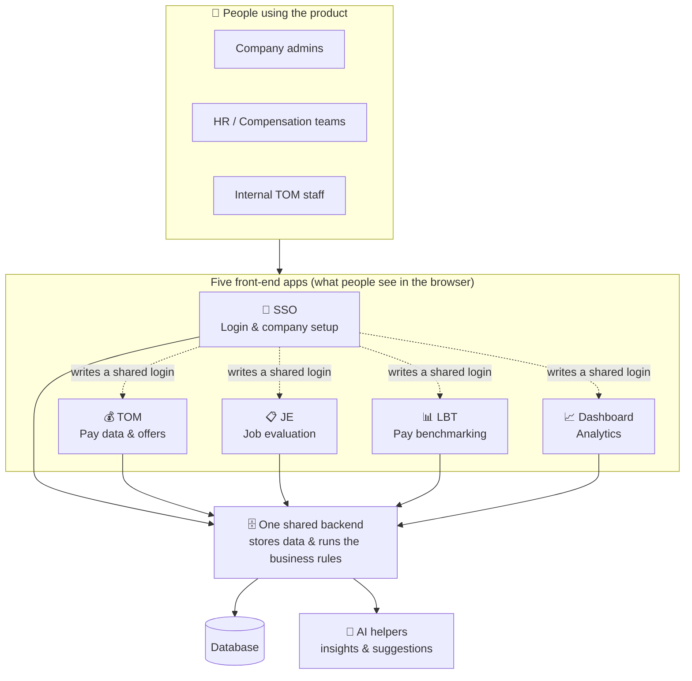
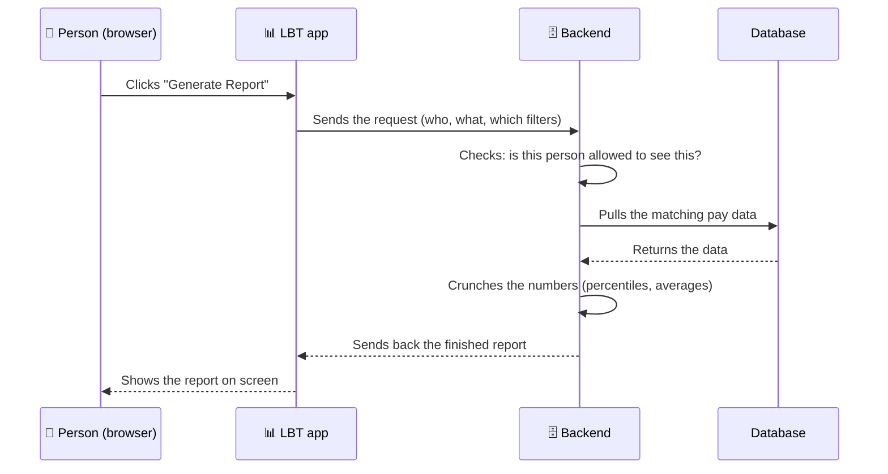

# The Talent Accelerator — Architecture at a Glance

> **Who this is for:** anyone who wants to understand how the product fits together —
> no coding background needed. Every diagram below is a picture first, with a short
> plain-language explanation underneath it.
>
> **What this is not:** this is not the detailed engineering documentation (that lives
> in the private docs site and is aimed at developers). This is the "explain it on a
> whiteboard" version — one level up, so anyone can see the shape of the system.

---

## 1. The big picture

The product is **one backend** (the database and business rules) serving **five separate
front-end applications** (the screens people actually click on). Think of the backend as
a kitchen, and the five apps as five different ordering counters that all cook from the
same kitchen.

**In plain words:**
- A person logs in **once**, through the **SSO app**. That login is then recognized by
  all the other four apps automatically — no separate password for each one.
- Every app talks to the **same backend**, so data entered in one place (e.g. a pay
  range set up in TOM) is instantly available everywhere else that needs it (e.g. when
  benchmarking in LBT).
- The backend is the only thing that touches the database. Apps never read the database
  directly — they always ask the backend for data.

---

## 2. The five front-end apps

| App | What it's for, in one line | Diagram |
|---|---|---|
| 🔑 **SSO** | The front door — login, and setting up companies/users | [frontend/sso.md](frontend/sso.md) |
| 💰 **TOM** | Managing pay data and building job offers | [frontend/tom.md](frontend/tom.md) |
| 📋 **JE** | Scoring a job's seniority/complexity to decide its grade | [frontend/job-evaluation.md](frontend/job-evaluation.md) |
| 📊 **LBT** | Comparing a company's pay against the market | [frontend/benchmarking.md](frontend/benchmarking.md) |
| 📈 **Dashboard** | Charts and trends built from all the above data | [frontend/dashboard.md](frontend/dashboard.md) |

---

## 3. The backend modules

The backend is organized into ~20 building blocks ("modules"). Each one owns one piece
of the puzzle. They're grouped below by what they're responsible for.

| Group | Modules | Diagram |
|---|---|---|
| 🔑 **Identity & company setup** | Authentication, Company setup, Admin users, App entitlements | [backend/identity-and-setup.md](backend/identity-and-setup.md) |
| 💰 **Compensation data & offers** | Compensation reference data, Offer modelling, Custom jobs | [backend/compensation-and-offers.md](backend/compensation-and-offers.md) |
| 📋 **Job evaluation & grading** | Job evaluation, Job grades, Grade normalization | [backend/job-evaluation-and-grading.md](backend/job-evaluation-and-grading.md) |
| 📊 **Benchmarking & data import** | Live Pay Benchmarking, CSV upload/import | [backend/benchmarking-and-import.md](backend/benchmarking-and-import.md) |
| 🤖 **AI & dashboards** | AI insights, AI offer analysis, Dashboard aggregation | [backend/ai-and-dashboards.md](backend/ai-and-dashboards.md) |
| 🧱 **Shared foundations** | Shared services, response format, error handling, file storage | [backend/shared-foundations.md](backend/shared-foundations.md) |

---

## 4. How a typical action flows through the system

Example: **a user views a benchmarking report.**

Every action in every app follows this same shape: **app asks → backend checks
permission → backend fetches/calculates → app displays the result.**

---

## 5. Legend used across all diagrams

| Symbol | Meaning |
|---|---|
| 🔑 | Login / security related |
| 💰 | Pay / money related |
| 📋 | Job evaluation related |
| 📊 | Benchmarking / reporting |
| 📈 | Analytics / dashboards |
| 🤖 | AI-powered feature |
| 🗄️ | Backend / server |
| 🧱 | Shared / foundational piece used by many modules |
| Solid arrow `-->` | Direct, synchronous call ("ask and wait for the answer") |
| Dotted arrow `-.->` | Indirect relationship (e.g. shared login, shared data) |

---

*This documentation is intentionally high-level and non-technical. For developer-level
detail (API endpoints, database fields, code structure), see the engineering
documentation site.*
