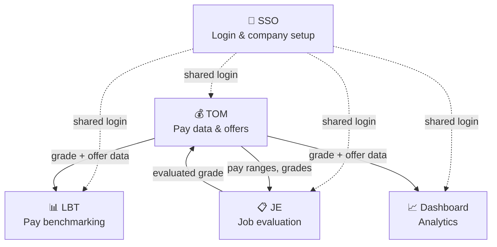
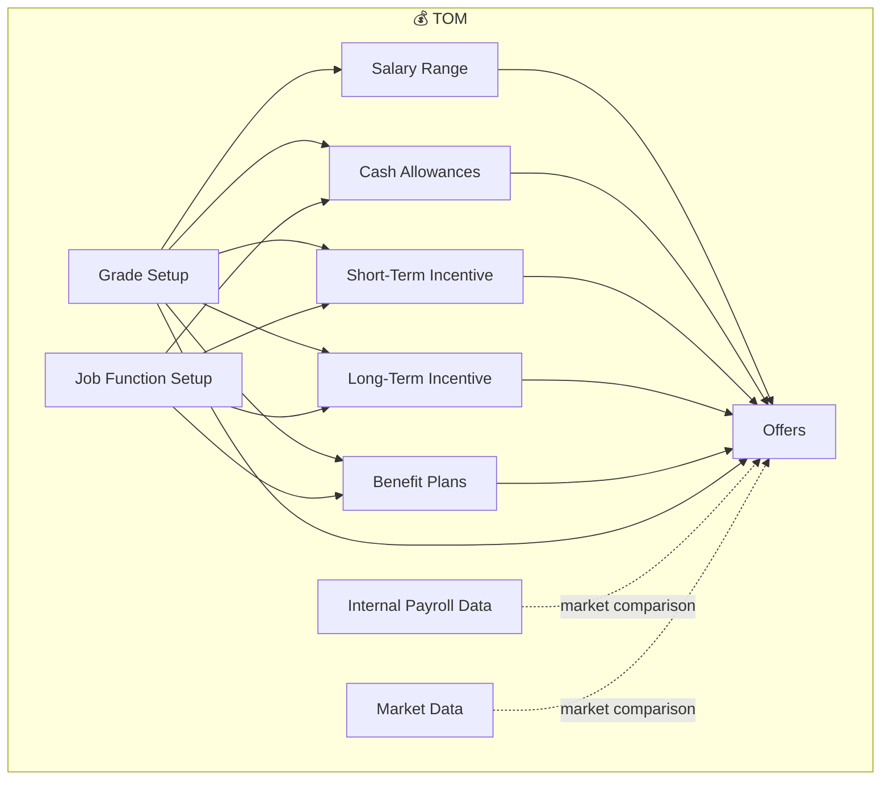
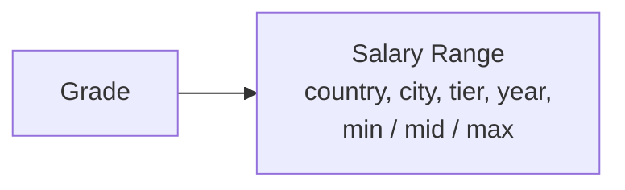
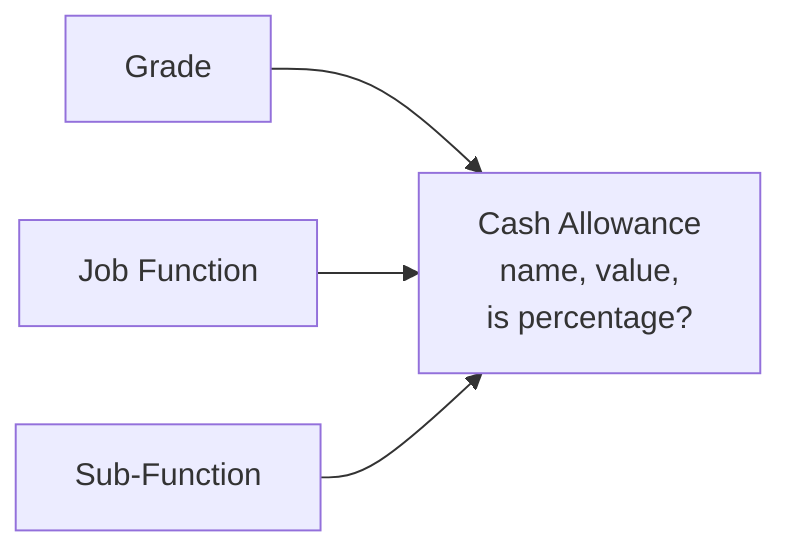
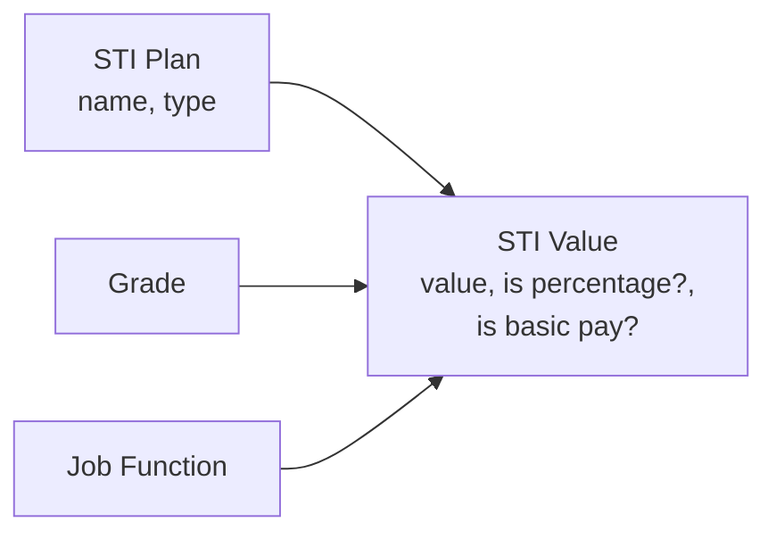
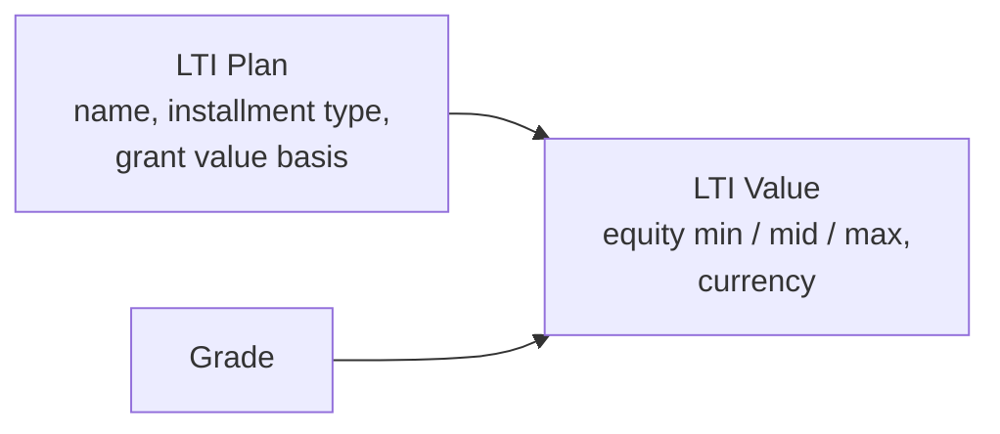
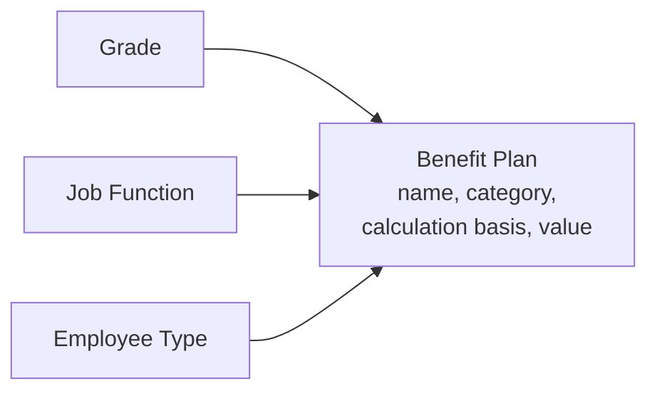
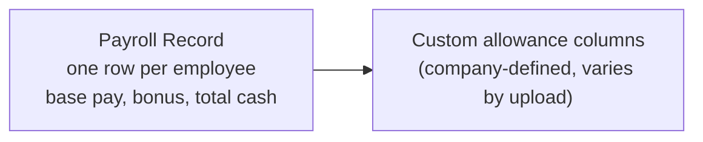
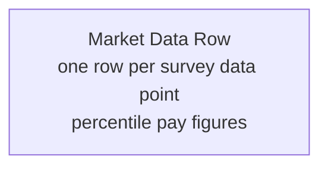
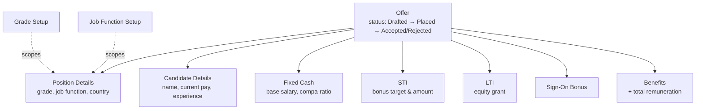

# The Talent Accelerator — Architecture Diagrams

One connected drill-down: the 5 apps → the modules inside each app → the actual
fields in each module and how they connect to each other.

> Starting with **TOM** (the largest app) end-to-end as the template. The same
> drill-down will be added for JE, LBT, Dashboard, and SSO next.

---

## Level 1 — The 5 apps

---

## Level 2 — TOM's modules

**In plain words:** Grade Setup and Job Function Setup are the foundation — nearly
every other module scopes its data to a grade and/or a job function. Offers is where
everything comes together: when someone builds an offer, it pulls from Salary Range,
Cash Allowances, STI, LTI, and Benefit Plans to calculate the full package.

---

## Level 3 — Field-level breakdown of each TOM module

Each module below follows the same pattern: a **Version** (a published batch of
data) holds many **rows**, and some rows have **scoping** — which grade / country /
job function they apply to.

### Grade Setup

| Field | Meaning |
|---|---|
| `grade` | The grade code/name (e.g. "M3") |
| `type` | Grade type/band label |
| `is_global` | Applies company-wide, or only in specific countries |

---

### Salary Range

| Field | Meaning |
|---|---|
| `grade` | Which grade this range is for |
| `country`, `city` | Where this range applies |
| `salary_min` / `salary_mid` / `salary_max` | The low / middle / high of the pay band |

---

### Cash Allowances

| Field | Meaning |
|---|---|
| `allowance_name` | Name of the allowance (e.g. "Housing") |
| `value` | The amount, or the percentage |
| `is_percentage` | Is `value` a % (of basic pay) or a flat amount |
| `is_all_grade` | Applies to every grade, or just the scoped one |

---

### Short-Term Incentive (STI) — the annual bonus

| Field | Meaning |
|---|---|
| `plan` | Which bonus plan this value belongs to |
| `value` | The bonus target amount or percentage |
| `is_percentage` | Is `value` a % of base pay |
| `is_basic_pay` | Calculated from basic pay specifically |

---

### Long-Term Incentive (LTI) — equity

| Field | Meaning |
|---|---|
| `installment_type` | How the grant pays out: Monthly / Quarterly / Semi-Annually / Annually |
| `grant_value` | Whether the grant is valued in cash ("Value") or share count ("Unit") |
| `equity_min` / `equity_mid` / `equity_max` | The equity grant range |
| `currency` | Currency the grant is valued in |

---

### Benefit Plans

| Field | Meaning |
|---|---|
| `category` | Statutory / Wellness / Health / Retirement / Financial / Lifestyle / etc. |
| `calculation_basis` | How the value is worked out — % of Basic, % of Guaranteed Cash, Flat Amount, etc. |
| `benefit_value_or_cte` | The benefit's value or cost-to-employer |
| `exclude_from_offer` | Hide this benefit when building an offer |

---

### Internal Payroll Data

| Field | Meaning |
|---|---|
| `annual_base_pay` | The employee's actual base salary |
| `total_guaranteed_cash` | Base + fixed allowances |
| `total_actual_cash` | Everything actually paid, including bonus |
| Custom allowance columns | Each payroll upload can define its own extra pay columns |

---

### Market Data

| Field | Meaning |
|---|---|
| `survey_company_name` | Which market survey this data came from |
| `annual_base_pay_p25/p50/p75` | Base pay at the 25th / 50th / 75th percentile |
| `target_total_rem_p25/p50/p75` | Total remuneration at those same percentiles |

---

### Offers — where everything comes together

| Field | Meaning |
|---|---|
| `status` | Drafted → Placed → Accepted / Rejected (or Edited, if revised) |
| `original_offer` | If this offer is a revision, links back to the original |
| `offer_fixed_cash.proposed_compa_ratio` | How the offered base compares to the salary range midpoint |

**Important connection detail:** when an offer is built, the Fixed Cash / STI / LTI /
Benefits numbers are **copied into the offer** at the time it's built — they don't
stay live-linked to Salary Range, Cash Allowances, STI, LTI, or Benefit Plans
afterward. Only **Position Details** keeps a live link back to Grade Setup and Job
Function Setup. So if a salary range changes later, offers already built don't
silently change — but the offer does flag if the reference data has changed since
it was built (a "data may be stale" check).

---

*Diagrams for JE, LBT, Dashboard, and SSO follow the same structure and are being
added next.*
