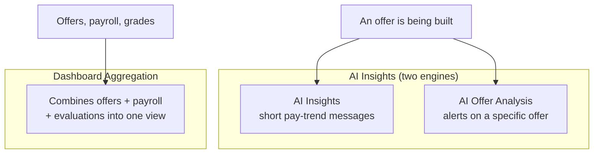
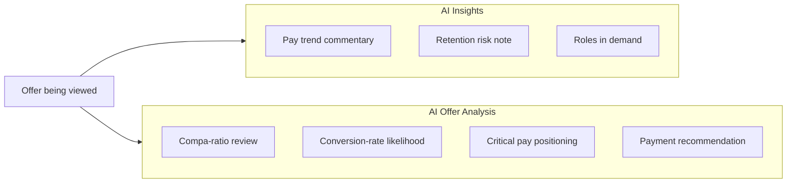

# 🤖 Backend: AI & Dashboards

[← Back to overview](../README.md)

## What this group does

These modules add a layer of **interpretation** on top of the raw data — either
through AI-generated commentary, or through aggregated charts.

## What's inside

## What the two AI engines each do

## Module-by-module

### AI Insights
Generates short, plain-language notes while someone is looking at an offer — things
like "pay for this role has been trending up," or "this role carries elevated
retention risk." If the AI service is unavailable, the system falls back to
pre-written generic messages so the feature never breaks completely.

### AI Offer Analysis
A more structured alert system: it runs a set of rule-based checks on an offer
(e.g. is the compa-ratio too low? how competitive is this against critical pay
benchmarks?) and then uses AI to turn the result into a readable summary with a
recommendation.

> **Note:** both of these are AI "copilots," not AI decision-makers — every suggestion
> is shown to a human, who makes the final call on the offer.

### Dashboard Aggregation
Pulls together data that lives in several other modules (offers, payroll, salary
ranges, evaluated grades) and pre-calculates the numbers the Dashboard app's charts
need — like compa-ratio and pay-gap figures — so the front-end can render them
quickly without doing heavy math itself.
