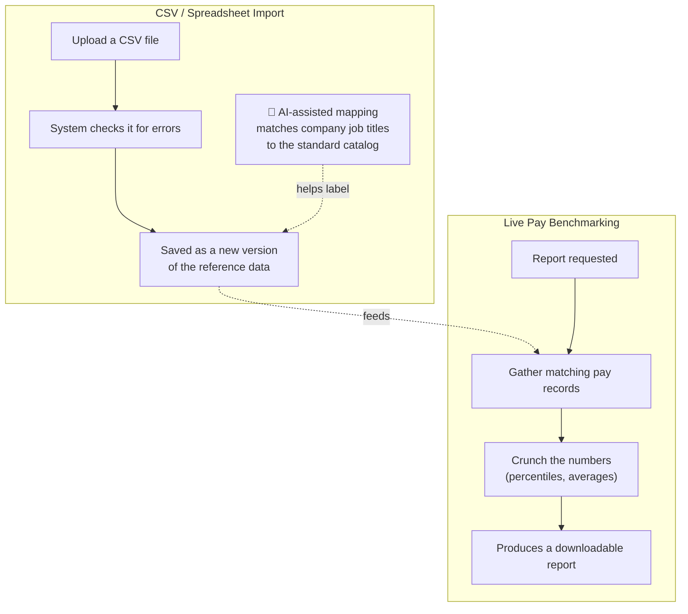
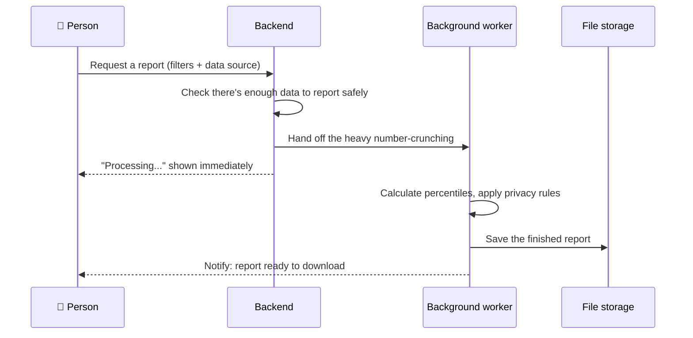

# 📊 Backend: Benchmarking & Data Import

[← Back to overview](../README.md)

## What this group does

These modules handle two things that are closely related: **pulling large amounts of
data in** (via spreadsheet upload) and **crunching large amounts of data to produce
market comparisons**.

## What's inside

## How a benchmarking report is built, step by step

## Module-by-module

### Live Pay Benchmarking
Pulls pay records (from offers and/or payroll — see the
[front-end LBT page](../frontend/benchmarking.md)) and calculates statistics like
"25th / 50th / 75th percentile pay for this role." It also applies **privacy rules**
— if too few companies or people are in a comparison group, the result is suppressed
rather than shown, so a single competitor's pay can never be singled out.
Report generation runs in the background because the calculation can take a little
time on large datasets.

### CSV Upload & Import
Lets an admin upload a spreadsheet to bulk-load or update any of the reference
datasets (salary ranges, payroll, market data, etc.) instead of entering each row by
hand. The system validates the file first (checking for missing fields, duplicate
rows, bad values) and only saves it if it passes.

It also includes an **AI-assisted matching tool**: when a company uploads its own
job titles, the AI suggests which standard job-title catalog entry each one most
likely corresponds to, so someone doesn't have to manually map hundreds of rows by
hand. A person still reviews and confirms the suggestions.
