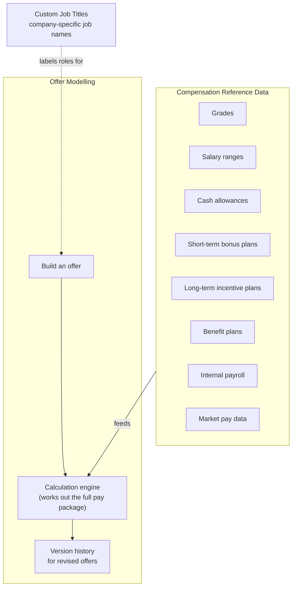
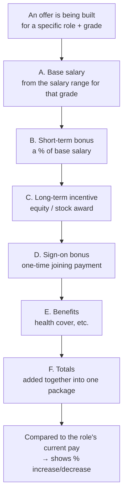

# 💰 Backend: Compensation Data & Offers

[← Back to overview](../README.md)

## What this group does

This is the heart of the product. It stores every piece of pay-related reference
data a company keeps, and uses that data to build and calculate job offers.

## What's inside

## How an offer's pay is calculated

## Module-by-module

### Compensation Reference Data
The "master list" of everything a company has set up: grade pay bands, allowance
rules, bonus plan rules, incentive plan rules, benefit rules, and the payroll +
market data it has uploaded. This data **changes in versions** — every time it's
updated, a new version is saved rather than overwriting the old one, so nothing is
silently lost.

### Offer Modelling
Takes the reference data above and uses it to build an actual offer for a real
candidate. A person picks a role/grade, and the system suggests numbers, which can
then be adjusted by hand before the offer is finalized and sent.

### Custom Job Titles
Some companies use their own internal job titles that don't match a standard
catalog. This module lets a company define its own list, which then gets mapped to
the standard list behind the scenes (see the AI mapping feature in
[Benchmarking & Data Import](benchmarking-and-import.md)).
