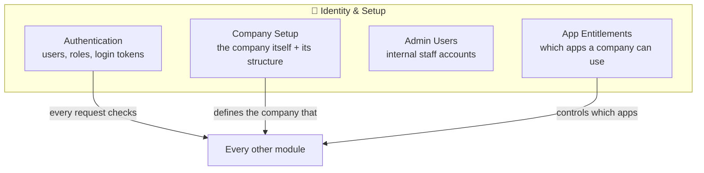
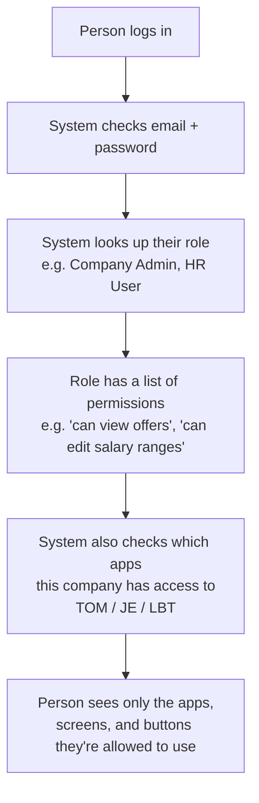

# 🔑 Backend: Identity & Company Setup

[← Back to overview](../README.md)

## What this group does

These modules answer two questions for every single request that hits the backend:
**"who is this?"** and **"what company/data are they allowed to touch?"**

## What's inside

## How a login turns into "what can I see"

## Module-by-module

### Authentication
Holds every user account, their role, and their permissions. A **role** is a named
bundle of permissions (e.g. "Company Admin" can create users; "Viewer" can only look).
A person can have a **different role in different apps** — e.g. an admin in TOM but a
viewer in JE.

### Company Setup
Defines what a "company" is in the system, plus everything hung off it: its regions,
business units, legal entities, and industry classification. Nearly every other
module refers back to a company — it's the hub everything connects to.

### Admin Users
Separate from company users — these are **internal staff accounts** (people who work
for the product team, not a customer company), used to manage the platform itself.

### App Entitlements
A simple on/off switch per company per app: does this company have access to TOM?
JE? Benchmarking? This is what the SSO app reads to decide which apps to show in the
app picker.
