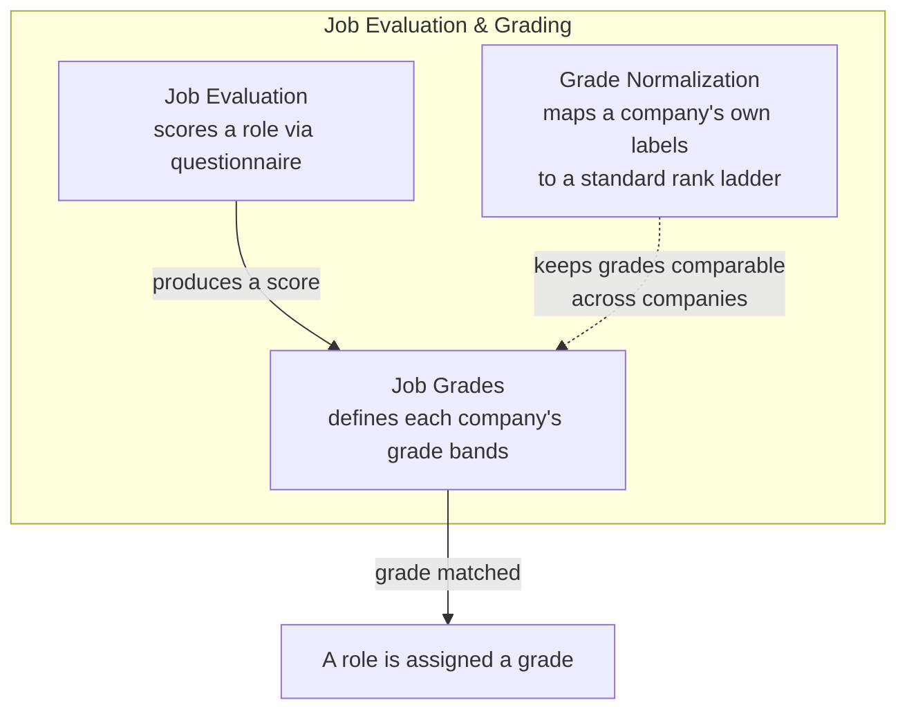
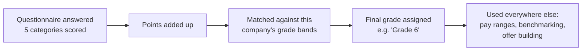

# 📋 Backend: Job Evaluation & Grading

[← Back to overview](../README.md)

## What this group does

These modules work together to answer "how big is this job, and what grade number
does it map to?" — the foundation that pay decisions are built on top of.

## What's inside

## From questionnaire to grade

## Module-by-module

### Job Evaluation
Runs the actual scoring questionnaire. A role is scored across five areas (skills
needed, problem-solving complexity, stakeholder management, decision-making impact,
and financial responsibility). The total score is what gets matched to a grade.

### Job Grades
Every company defines its **own grade bands** — e.g. "100–200 points = Grade 1,
201–300 = Grade 2," and so on, with a label for each. This module stores those
bands and does the matching.

### Grade Normalization
Different companies may call the same seniority level different things (one company's
"Grade 5" might be another's "Band C"). This module keeps a standard internal rank
ladder so that, behind the scenes, grades stay comparable when the system needs to
compare across companies (for example, in benchmarking).
