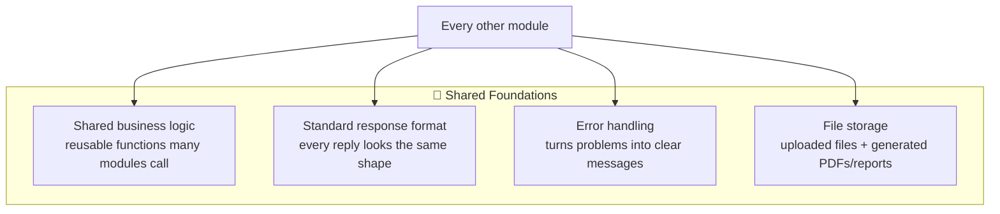

# 🧱 Backend: Shared Foundations

[← Back to overview](../README.md)

## What this group does

These are not features anyone sees directly — they're the plumbing that every other
module relies on, so that the product behaves **consistently** no matter which
screen or app you're using.

## What's inside

## Why a "standard response format" matters

## Module-by-module

### Shared Business Logic
A toolbox of reusable functions that many modules call — for example, "get all the
business units a particular user is allowed to see." Having this in one place means
the same rule is applied consistently everywhere, instead of being reimplemented
(and possibly done slightly differently) in five different places.

### Standard Response Format
Every single reply from the backend — whether it's a success or a failure — comes
back in the same consistent shape. This is what lets all five front-end apps handle
responses the same way, which keeps the apps simpler and more predictable to build.

### Error Handling
When something goes wrong (bad input, something not found, no permission), this is
the piece that catches it and turns it into a clear, consistent error message rather
than a raw technical crash.

### File Storage
Handles files that get uploaded (CSV imports, documents) or generated (offer PDFs,
benchmarking report downloads), storing them securely and handing back a link when
they're needed.
