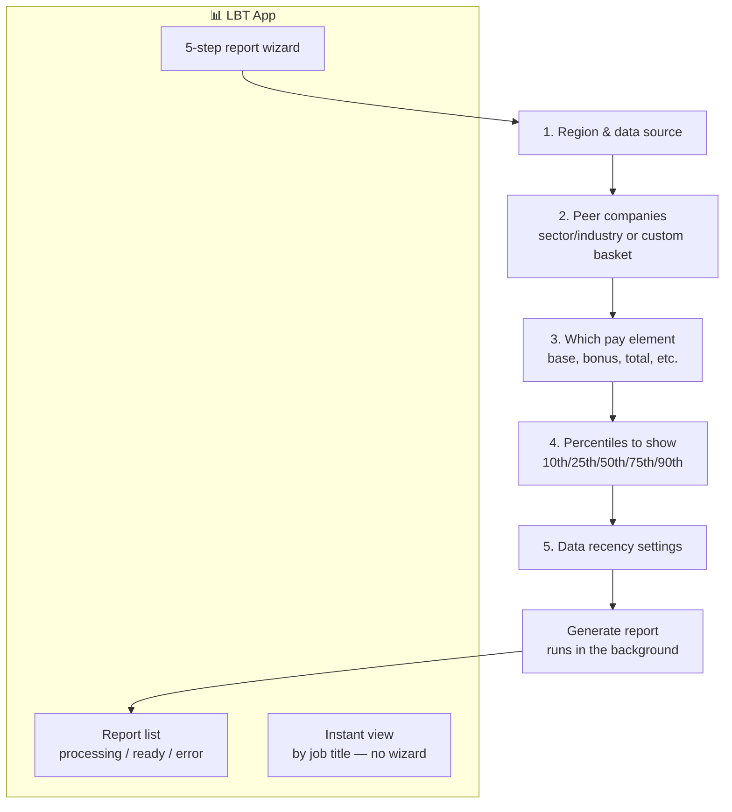
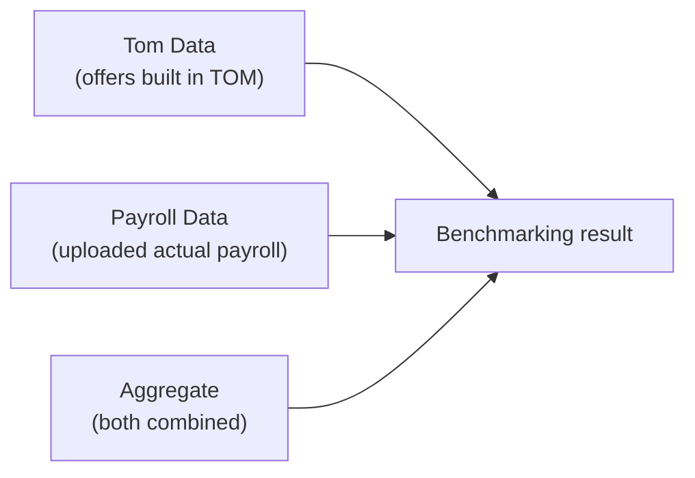

# 📊 LBT — Live Pay Benchmarking

[← Back to overview](../README.md)

## What it's for

This app answers the question **"are we paying competitively?"** — it compares a
company's pay against market data and/or its own payroll, and shows where it sits
(e.g. "we're paying this role at the 40th percentile of the market").

## What's inside

## The three data sources you can compare against

## In plain words

- **"Tom Data"** = offers that were modelled in the TOM app (what the company
  *intended* to pay).
- **"Payroll Data"** = actual payroll numbers the company uploaded (what people are
  *actually* being paid).
- **"Aggregate"** = both pooled together into one combined picture.
- A report can take a little while to build (it's crunching a lot of numbers), so it
  shows as **"Processing"** and the screen automatically checks back every few
  seconds until it's ready to download.
- There's also a **quick, instant view** ("By Title") for when you just want a fast
  answer for one job title, without going through the full wizard.
- To protect competitor privacy, a **custom peer group** (comparing against specific
  chosen companies) requires at least 10 companies in the group — so no single
  competitor's pay can be reverse-engineered from the result.
