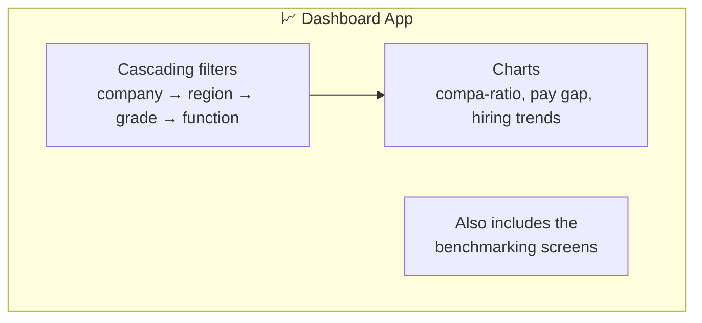
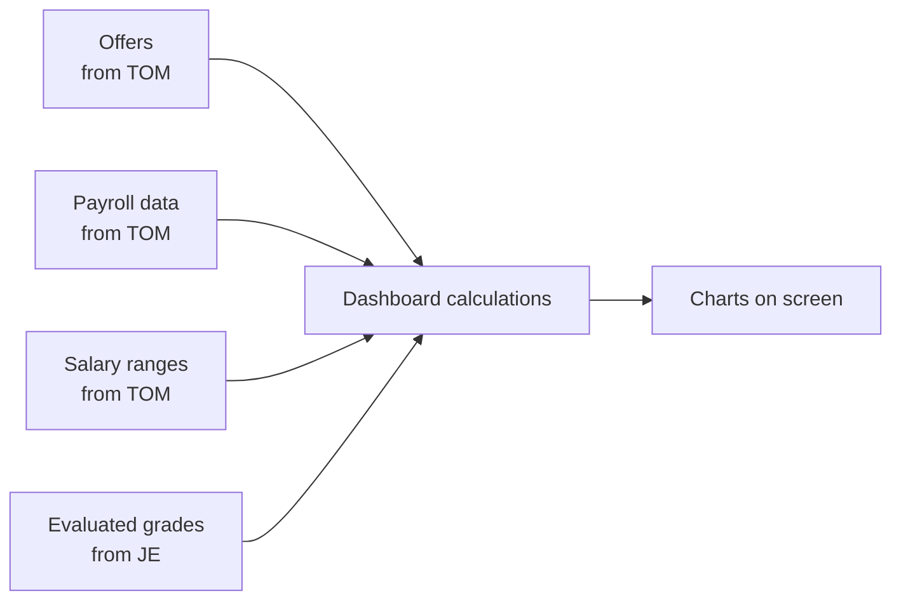

# 📈 Dashboard — Analytics

[← Back to overview](../README.md)

## What it's for

This app turns all the data sitting in the other apps into **charts and trends** —
a bird's-eye view for leadership and HR to spot patterns (e.g. "are we underpaying
women relative to men in this grade?", "how has our hiring pay trended this year?").

## What's inside

## Where the numbers come from

## In plain words

- The Dashboard app **doesn't collect any new data itself** — it reads data that was
  already entered in TOM and JE, and presents it visually.
- **Compa-ratio** is one of the headline numbers: it tells you, on average, whether
  people are being paid above, at, or below the middle of their pay range.
- Filters let you slice the picture down — e.g. "just this region" or "just this
  grade" — without needing to ask IT for a custom report.
