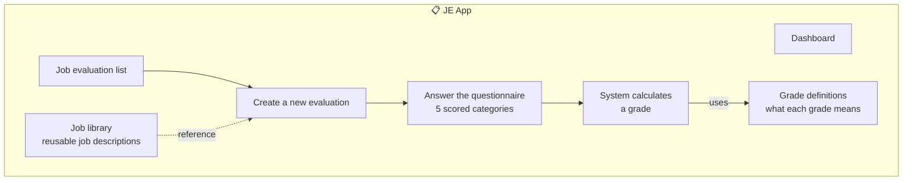
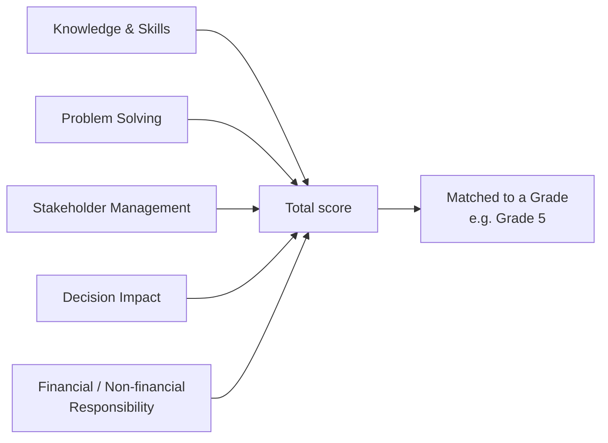

# 📋 JE — Job Evaluation

[← Back to overview](../README.md)

## What it's for

Before you can pay someone fairly, you need to know **how big the job is**. JE is a
questionnaire-driven tool: you answer a set of standard questions about a role
(how much decision-making it involves, how much it affects financial results, etc.),
and the system works out which **grade** that role belongs to.

## What's inside

## The five scoring categories

## In plain words

- Think of it like a **points-based test for a job**, not for a person. The same
  questionnaire, answered the same way, always gives the same grade — it's
  consistent across the whole company.
- Each category contributes points; the points are added up and matched against the
  company's grade bands (set up by an admin) to land on a final grade.
- Once a role has a grade, **TOM** uses that grade to pull the right salary range,
  bonus target, and benefits when building an offer for that role — JE and TOM are
  connected through the grade, even though they're separate apps.
- An evaluation moves through a simple lifecycle: **Open → Evaluated → Submitted/Closed.**
