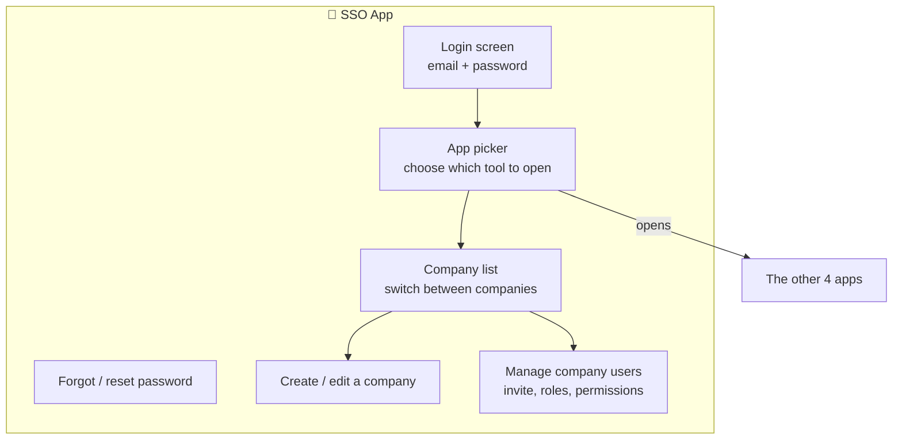
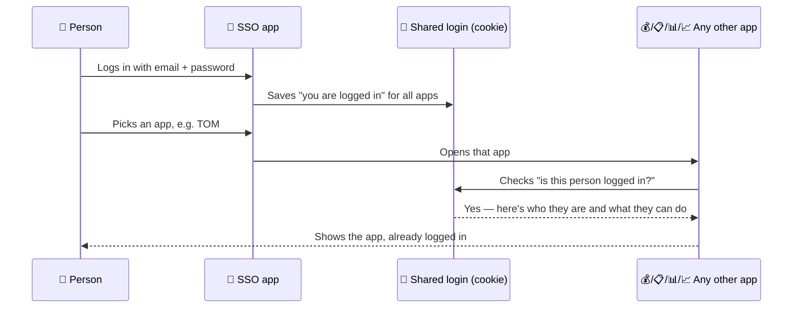

# 🔑 SSO — Login & Company Setup

[← Back to overview](../README.md)

## What it's for

This is the **front door** to the whole product. It's the only app where people
actually type a password. Once logged in here, the system remembers who you are
everywhere else — you never log in again for the other four apps.

It's also where a company gets **set up** for the first time, and where new users
get invited.

## What's inside

## How login works for everyone else

## In plain words

- **Nobody else has a real login screen.** The other four apps just check "did this
  person already log in through SSO?" — if yes, they're let straight in.
- **Company admins** use this app to invite teammates and decide what each teammate
  is allowed to see or edit (their "role").
- **A person can belong to more than one company** — the company picker is how they
  switch between them.
