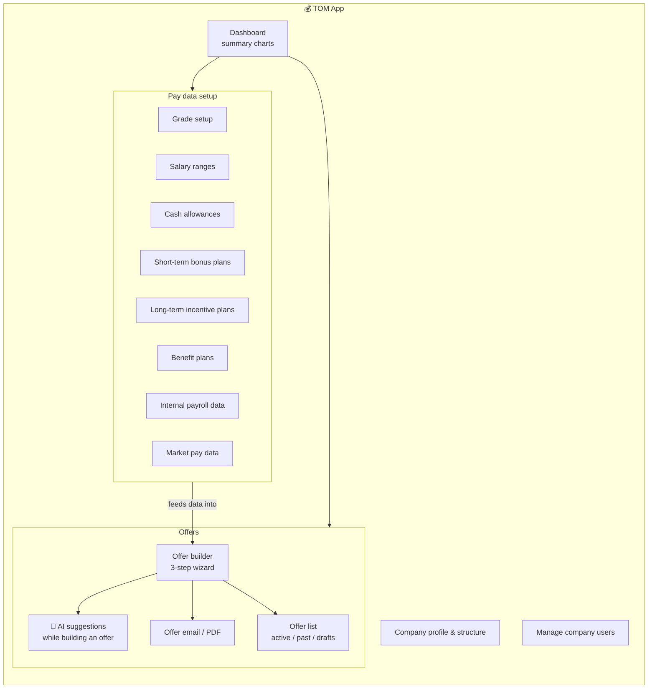
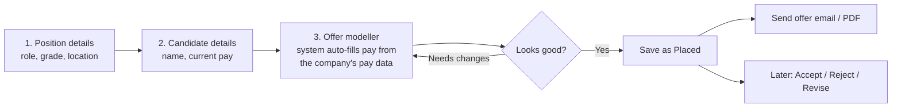

# 💰 TOM — Pay Data & Offers

[← Back to overview](../README.md)

## What it's for

TOM is the biggest and busiest app. It's where a company:
- keeps its **pay data** (salary ranges, bonus rules, benefits, grades) up to date, and
- builds **job offers** for candidates, with the system calculating the full pay
  package automatically.

## What's inside

## Building an offer, step by step

## In plain words

- **Pay data setup** is the "ingredients" — grades, salary bands, bonus rules, etc.
  Someone (usually an admin) keeps these current, often by uploading a spreadsheet
  (CSV) instead of typing each row by hand.
- **The offer builder** is the "recipe" — it takes those ingredients and, once you
  pick a role and grade, automatically works out a suggested pay package. A person can
  then adjust it before sending.
- **The AI assistant** watches the offer as it's being built and surfaces things like
  "this offer is below the usual range for this grade" — a second pair of eyes, not a
  replacement for a human decision.
- **Offers can be revised** — if terms change after an offer is placed, a new version
  is created rather than overwriting history, so there's always a record of what was
  originally offered.
